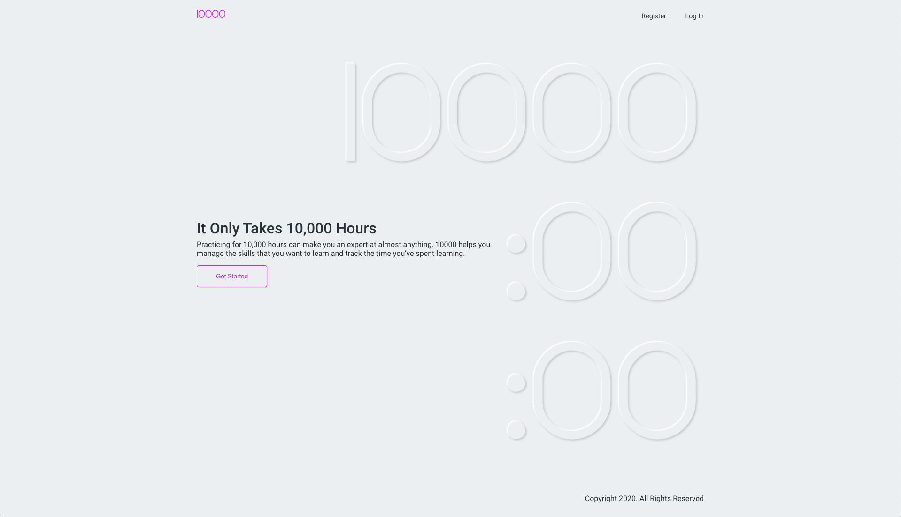

## It Only Takes 10,000 Hours

In his book [Outliers](https://en.wikipedia.org/wiki/Outliers_(book)), Malcom Gladwell explains that reaching the 10,000-Hour Rule, which he considers the key to success in any field, is simply a matter of practicing a specific task for 10,000 hours, or 20 hours of work a week for 10 years.

## 10000
Practicing for 10,000 hours can make you an expert at almost anything. 10000 helps you manage the skills that you want to learn and track the time you’ve spent learning.

Home

Login

Skills

## Technology Stack
10000 is build using the PERN stack, which includes PostgreSQL, Express, React and Node.
