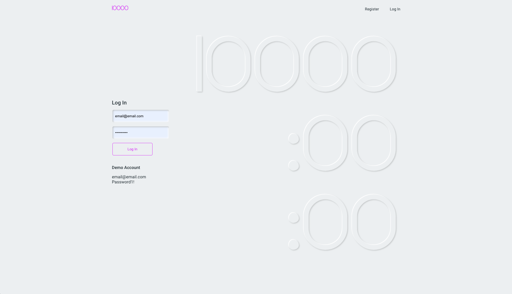

in progress...

## It Only Takes 10,000 Hours

In his book [Outliers](https://en.wikipedia.org/wiki/Outliers_(book)), Malcom Gladwell explains that reaching the 10,000-Hour Rule, which he considers the key to success in any field, is simply a matter of practicing a specific task for 10,000 hours, or 20 hours of work a week for 10 years. But despite the nobility of such an endeavor, accurately tracking progress up to 10,000 hours can be an overwhelming task in and of itself.

## 10000
10000 helps you manage the skills that you want to learn and track the time you’ve spent learning uo to 10,000 hours. To use the app, simply:

1. Click "Get Started" from the home page

2. Log In (assuming that you have already registered)

3. Add Skills

4. Track Your Progress

## Technology Stack
10000 is build using the PERN stack, which includes PostgreSQL, Express, React and Node.
